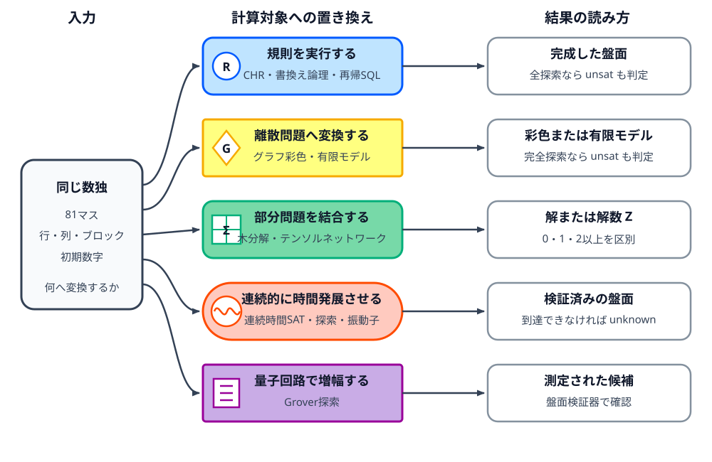
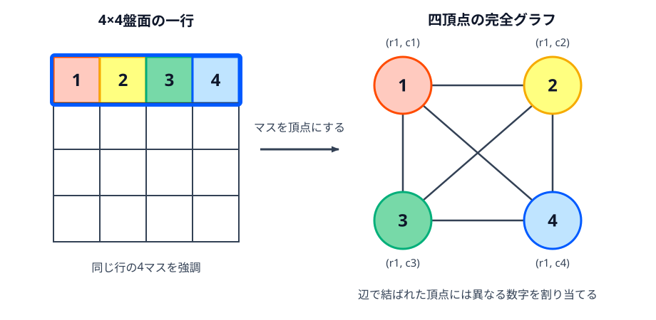
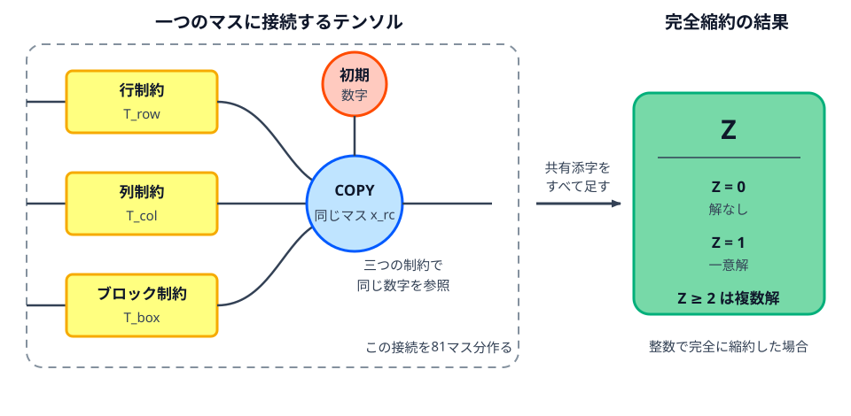

======================================
補遺A まだある数独の表し方
======================================

数独を別の問題へ置き換える方法は、本編で実装したもの以外にもあります。ここでは、何を変数にし、
数独の規則をどう表し、結果から何が分かるかを方式ごとに整理します。実装は扱いません。

共通の記号として、行 :math:`r`、列 :math:`c`、数字 :math:`d` を使います。
:math:`x_{r,c,d}=1` は「行 :math:`r`、列 :math:`c` のマスに数字 :math:`d` を置く」ことを
表します。方式によっては81個のマスを直接変数にしますが、729個の0-1変数へ展開すると既存章との
対応を確認しやすくなります。

.. list-table:: この補遺で扱う方式
   :header-rows: 1
   :widths: 25 35 20 20

   * - 方式
     - 数独を何として見るか
     - 主な結果
     - 失敗時の扱い
   * - CHR、書換え論理
     - 候補を書き換える規則
     - 完成した盤面
     - 規則と探索方法による
   * - 再帰SQL
     - 盤面を次々に生成する問い合わせ
     - 完成した行
     - 全探索なら ``unsat``
   * - グラフ彩色、有限モデル発見
     - 彩色または論理構造
     - 彩色、有限モデル
     - 完全なソルバなら ``unsat``
   * - 木分解、テンソルネットワーク
     - 局所的な表とその結合
     - 解、解数
     - 厳密計算なら ``unsat``
   * - 連続時間SAT、メタヒューリスティック、振動子
     - 微分方程式または評価関数
     - 検証済みの盤面
     - ``unknown``
   * - Grover探索
     - 正解だけを印付けする量子回路
     - 測定された候補
     - 通常は ``unknown``

   左端の数独の規則は同じです。中央の何へ置き換えるかによって、右端で得られる結果と
   ``unsat`` を判断できる条件が変わります。箱の色に加えて、記号と方式名でも経路を区別しています。

規則を書けば計算になる方式
============================

Constraint Handling Rules
-------------------------

`Constraint Handling Rules（CHR） <https://www.swi-prolog.org/pldoc/man?section=chr-intro>`_ は、
制約を保存する **制約ストア** と、その内容を書き換える規則を記述する言語です。制約ストアは、
現在残っている候補や確定した値を置く作業領域です。SWI-PrologではPrologへ
埋め込まれています。Prologが目標に対応する節を試すのに対し、CHRは制約ストアに置かれた制約へ
適用可能な規則を繰り返し働かせます。:cite:labelpar:`SWIPrologCHR2026`
CHRの規則は、制約ストアから
条件に合う制約を見つけ、別の制約を加えたり、不要になった制約を削除したりします。

数独では、たとえば ``candidate(r,c,d)`` を「マス :math:`(r,c)` の候補に :math:`d` が残って
いる」、``fixed(r,c,d)`` を「そのマスは :math:`d` に確定した」という制約にします。確定した
数字と同じ数字を、そのマスの仲間から消す規則は次のように読めます。

.. code-block:: text

   fixed(r, c, d) と candidate(r2, c2, d) があり、二つのマスが同じ行・列・ブロックに属する
   → candidate(r2, c2, d) を削除する

候補が一つだけ残ったマスを ``fixed`` に変える規則と、候補がなくなったら失敗する規則も加えます。
この時点では、人が候補を書き込んで消していく解き方に近い伝播器です。規則の適用だけで確定しない
盤面をすべて解くには、候補を一つ選ぶ分岐も必要です。

CHRによる解法の完全性は、分岐の有無で決まります。伝播規則だけで途中停止した結果は ``unknown``
です。有限個の候補を漏れなく分岐し、各分岐で規則を適用すれば、第1章「バックトラック」と同様に解なしや
複数解を検証します。

書換え論理とMaude
-----------------

`書換え論理 <https://maude.cs.illinois.edu/wiki/Rewriting_Logic>`_ では、盤面を一つの「項」として
表し、項を別の項へ変える規則を計算に使います。処理系
`Maude <https://maude.cs.illinois.edu/wiki/The_Maude_System>`_ には、規則を一回適用する実行に
加えて、到達可能な項を探索する機能があります。

ここでいう **項** は、盤面やマスを一定の記法で組み立てたデータです。たとえば
``cell(1,2,0,{2,4})`` なら、値0を未確定として、1行2列のマスに候補2と4が残る状態を表せます。

各マスを ``cell(r,c,value,candidates)`` のような項にし、81個のマスを順序に依存しない集合として
盤面へ入れます。候補の計算、候補の削除、候補が一つになったマスの確定は、それぞれ別の書換え規則に
できます。実際にMaudeで数独を扱った例では、盤面の走査、候補の記入、候補の分析を規則として
記述し、必要な場合は仮定を置く処理も加えています。:cite:labelpar:`SantosGarciaPalomino2007Sudoku`

一つの書換え経路だけを実行するなら、規則の選び方によって途中で止まる可能性があります。
適用できる規則や候補が複数あるとき、最初から一つに固定せず分岐として扱うことを **非決定的** と
呼びます。未確定の候補を一つ選ぶ規則を非決定的にし、Maudeの探索で到達可能な完成項をすべて調べれば、
探索木を項の書換えとして表現します。第10章「モデル検査」が「完成状態へ到達できるか」を性質として
検証したのに対し、本手法では盤面を変更する規則そのものが解法として機能します。

再帰SQL
-------

`再帰共通表式（recursive CTE） <https://www.sqlite.org/lang_with.html#recursive_common_table_expressions>`_
は、問い合わせの結果を同じ問い合わせの次の入力にできます。数独では、盤面を81文字の文字列または
81行の表として持ち、再帰CTEの一行を探索中の一盤面に対応させます。

通常の ``SELECT`` は表から条件に合う行を取り出します。再帰CTEでは、最初に取り出した行へ
同じ生成規則を繰り返し適用し、次の行を作れます。

最初のSELECTは初期盤面を一行返します。再帰側のSELECTは、空きマスを一つ選び、同じ行・列・
ブロックにない数字ごとに新しい盤面を生成します。空きマスがない行だけを最後のSELECTで取り出せば、
それが完成盤面です。概念上は次の関係をSQLで計算しています。

.. math::

   \operatorname{next}(B,B')
   \quad\Longleftrightarrow\quad
   B'\text{ は盤面 }B\text{ の空きマス一つへ置ける数字を入れた盤面}

SQLiteの再帰CTEは、初期SELECTの結果をキューへ入れ、取り出した行に再帰SELECTを適用して次の行を
追加します。``ORDER BY`` を使うと、深さ優先または幅優先に近い取り出し順も指定できます。
:cite:labelpar:`SQLiteRecursiveCTE2026`

これはバックトラックの探索木を関係と問い合わせで表したものです。人工的な行数制限を置かず、
すべての合法な数字を生成するなら完全です。盤面を一行ずつ生成するため、専用ソルバの制約伝播や
学習をそのまま利用できません。

別の離散問題へ置き換える方式
============================

グラフ彩色とリスト彩色
----------------------

`数独グラフ <https://en.wikipedia.org/wiki/Sudoku_graph>`_ は、81個のマスを頂点にし、同じ行・
列・ブロックにある二つのマスを辺で結んだグラフです。標準の9×9数独では、各頂点は20個の頂点と
隣接し、重複を除くと辺は810本あります。

ここでは、マスを点で表したものが **頂点**、同じ数字を置けない二マスを結ぶ線が **辺** です。
辺で結ばれた二頂点を **隣接する** と呼びます。

   見やすいように4×4の一行で示しています。同じ行のマスは互いに隣接するため、四頂点には
   異なる四つの数字が必要です。数字を直接書いているので、色を見分けなくても対応を追えます。

数字1〜9を九つの色と考えると、数独の規則は「辺で結ばれた頂点へ同じ色を塗らない」という条件に
なります。初期数字のある頂点は色を固定します。各頂点に許された色の集合を持たせる
`リスト彩色 <https://en.wikipedia.org/wiki/List_coloring>`_ として書けば、初期数字は一色だけの
リスト、空きマスは1〜9のリストです。

行、列、ブロックはいずれも九つの頂点が互いに隣接する部分グラフです。九色の正しい彩色では、
その九頂点に九色が一度ずつ現れるため、完成彩色をそのまま完成盤面へ復元します。彩色ソルバが完全であれば、
二つ目の彩色の探索や、彩色不能状態に基づく解なし判定を実行します。変換後も探索の複雑性は保持されますが、
一般のグラフ彩色用アルゴリズムを直接適用する形式となります。

有限モデル発見と定理証明
------------------------

`有限モデル発見 <https://en.wikipedia.org/wiki/Finite_model_theory#Finite_model_finding>`_ は、
一階述語論理で書かれた文を満たす有限の構造を探します。数独では、行、列、数字をそれぞれ九要素の
集合とし、各要素に1〜9を表す定数を置きます。二引数の関数
:math:`\operatorname{value}(r,c)` は数字を返します。

**一階述語論理** は、対象、その間の関係、対象を別の対象へ対応させる関数を使って条件を書く体系です。
この文脈で **構造** または **モデル** とは、行や列などの対象と、関数の具体的な値をまとめたものです。
論理文をすべて真にするモデルを一つ見つけることが、数独の完成盤面を一つ見つけることに対応します。

同じ行の異なる列 :math:`c_1,c_2` については、次の文を置きます。列とブロックにも同じ条件を
加え、初期数字は関数値の等式にします。

.. math::

   c_1 \ne c_2
   \quad\Longrightarrow\quad
   \operatorname{value}(r,c_1) \ne \operatorname{value}(r,c_2)

この式は、「同じ行 :math:`r` にある異なる二列 :math:`c_1,c_2` の数字は等しくない」と読みます。

この公理群のモデル一つが完成盤面一つです。`Mace4 <https://www.cs.unm.edu/~mccune/prover9/manual/2009-11A/mace4.html>`_
のような有限モデル発見器は、指定した大きさの領域について一階述語論理のモデルを探索します。
:cite:labelpar:`McCune2003Mace4` 探索されたモデルを除外して再検索を実行し、解の一意性を決定します。

有限モデル発見器と定理証明器は役割が異なります。前者は条件を満たす具体的な構造を探します。
後者は、公理から矛盾が導けることを証明します。解なしを扱うには、九要素という有限の範囲を完全に
探索できる処理系を使うか、公理群の充足不能性を証明する必要があります。

部分問題をつないで解く方式
==========================

木分解と動的計画法
------------------

数独を制約充足問題として見ると、81個のマスが変数です。同じ制約に現れる変数同士を辺で結んだ
グラフを作り、その頂点を重なりのある小さな集合へ分けます。この集合を **バッグ** と呼び、バッグ
同士が木になるようにつないだものが
`木分解 <https://en.wikipedia.org/wiki/Tree_decomposition>`_ です。

正しい木分解では、同じ制約に現れる変数がどこかのバッグに一緒に入り、同じ変数を含むバッグが
木の途中で途切れないように並びます。この条件により、共有するマスの値だけを隣のバッグへ渡せます。

葉のバッグから順に、そのバッグ内で規則を満たす数字の組を表へ保存します。親子のバッグが共有する
マスについて数字が一致する組だけを結合すれば、すでに処理した部分盤面を何度も解き直さずに済みます。
表へ解数も持たせれば、根まで処理したときに盤面全体の解数が得られます。制約充足問題を木分解に沿った
動的計画法で解く方法は、部分問題の構造を利用する厳密解法です。:cite:labelpar:`KosterHoeselKolen2002TreeDecomposition`
ここでいう **動的計画法** は、部分盤面の結果を表に保存し、同じ部分問題を繰り返し解かずに再利用する
進め方です。

必要な表の大きさは、最大のバッグに含まれる変数の数に強く左右されます。最大のバッグの変数数から
1を引いた値を分解の幅 :math:`w` と呼びます。各マスが九通りなら、単純な表はおおむね
:math:`9^{w+1}` 個の割り当てを保持します。
数独グラフには行・列・ブロックの密なつながりがあるため、分解を作るだけで効率化できるとは限りません。
それでも、盤面を領域ごとに処理して境界の情報だけを受け渡す、という見方は他の章にないものです。

テンソルネットワーク縮約
------------------------

第15章の因子グラフでは、変数と制約の間で近似的なメッセージを送りました。同じグラフの各制約を
0と1からなる多次元配列、すなわちテンソルへ変えると、すべての割り当てを和と積でまとめて扱えます。
テンソルの各軸に付けた番号を **添字** と呼び、二つのテンソルが共有する添字について積を足し合わせる
操作を **縮約** と呼びます。

行、列、ブロックの ``all-different`` 制約をテンソル :math:`T_f` とします。受け取った九個の数字が
すべて異なるときだけ :math:`T_f=1`、それ以外は0です。同じマスが三つの制約へ現れる箇所では、
三つの添字が同じ数字を指すときだけ1になるCOPYテンソルで接続します。すべての共有添字について和を
取ります。初期数字は、指定された数字の成分だけが1になる一引数のテンソルで固定します。ネットワークの
完全縮約は、次の値になります。

COPYテンソルの役割は、行、列、ブロックが参照する同じマスの数字を一致させることです。

   四角は制約テンソル、中央の円は同じマスの値をそろえるCOPYテンソルです。この接続を盤面全体へ
   広げて共有添字を足すと、解数 :math:`Z` が残ります。形とラベルでも役割を区別しています。

.. math::

   Z=\sum_{x_1,\ldots,x_{81}}\prod_f T_f(x_f)

内側の積は、一つの盤面が全制約を満たすときだけ1になります。外側の和は、考えられる全盤面について
その値を足します。

規則に違反する割り当ては積が0になり、正しい完成盤面だけが1を加えます。そのため :math:`Z` は
解数です。:math:`Z=0` の状態は解なし、:math:`Z=1` の状態は一意解を示します。特定のマスを一つの数字へ固定して
再び縮約を実行し、該当の数字を含む解の存在性を評価します。制約充足問題をテンソルネットワークへ変換し、
完全縮約で解数を求める方法が提案されています。:cite:labelpar:`KourtisEtAl2019TensorCounting`

計算量を左右するのは縮約順序です。悪い順序では、途中で多数の添字を持つ巨大なテンソルができます。
よい順序を探す問題は木分解と近い関係にあります。整数を使って完全に縮約すれば厳密ですが、途中の
テンソルを近似的に切り詰めた場合は、解なしや一意性をその値だけで断定できません。

離散探索を力学系へ移す方式
==========================

連続時間SAT
-----------

第7章と同じように数独をCNFへ変換した後、真偽変数を連続値へ置き換える方法があります。
`連続時間SATソルバ <https://www.nature.com/articles/nphys2105>`_ では、真を :math:`s_i=1`、偽を
:math:`s_i=-1` とし、各SAT節 :math:`m` の違反量を関数 :math:`K_m` で測ります。

節に変数 :math:`s_i` が肯定形で現れるとき :math:`c_{mi}=1`、否定形なら :math:`-1`、現れない
とき0とします。節のリテラル数を :math:`k_m` とすると、次の関数は節のどれかが真になったとき0です。

.. math::

   K_m(s)=2^{-k_m}\prod_i(1-c_{mi}s_i)

たとえば肯定形の変数が真なら :math:`s_i=1,c_{mi}=1` なので、その因子は
:math:`1-c_{mi}s_i=0` です。積全体も0になり、節が満たされたことを表します。節の全リテラルが
偽のときだけ、違反量が正になります。

補助変数 :math:`a_m` で満たされにくい節の影響を強め、たとえば
:math:`V(s,a)=\sum_m a_mK_m(s)^2` を下げる方向へ :math:`s` を動かします。同時に、違反が残る節では
:math:`a_m` を増やします。Ercsey-RavaszとToroczkaiは、この形の連続時間力学系でSATの解クラスタと
アトラクターを対応させています。:cite:labelpar:`ErcseyRavaszToroczkai2011AnalogSAT`

数独のモデル自体はSAT章の729変数と節を再利用できます。異なるのは、その節をDPLLやCDCLで探索せず、
常微分方程式の軌道として解へ近づける点です。数値積分では停止時刻、許容誤差、初期値を決める必要が
あります。丸めた盤面が検証器を通れば ``solved`` と言えますが、時間内に到達しなかったことから
``unsat`` は導けません。

メタヒューリスティック
----------------------

焼きなまし、タブー探索、遺伝的アルゴリズムなどの
`メタヒューリスティック（Wikipedia） <https://en.wikipedia.org/wiki/Metaheuristic>`_ は、解の候補と評価関数、
候補を少し変える操作を設計して探索します。数独では、各3×3ブロックへ不足している数字を一度ずつ
入れた盤面から始めると、マスとブロックの規則を常に保てます。

評価関数は、各行と各列で重複している数字の数にします。近傍操作として同じブロック内の二つの
可変マスを交換すれば、初期数字とブロックの条件を壊さず、行と列の違反だけを増減できます。
ここで **近傍** とは、一回の交換で現在の盤面から移れる候補盤面の集合です。
焼きなましなら、評価が下がる交換を受け入れ、ときどき評価が上がる交換も温度に応じて受け入れます。
この表現と近傍を使った数独の焼きなまし法も報告されています。:cite:labelpar:`Lewis2007SudokuMetaheuristics`

評価値が0になった盤面は厳密な解です。ただし、局所解に止まったことや反復上限へ達したことは、
解が存在しない証拠ではありません。乱数シード、終了条件、再試行回数を記録し、失敗は ``unknown``
とします。一意性を確かめるには、見つけた解と異なる解を探索する仕組みを別に用意する必要があります。

振動ニューラルネットワーク
--------------------------

`振動ニューラルネットワーク（arXiv） <https://arxiv.org/abs/2508.02250>`_ は、
結合した振動子の位相や同期状態を計算に使います。数独では各マスを振動子に対応させ、九つの数字を
九つの位相へ割り当てます。初期数字の位相は固定し、同じ行・列・ブロックの振動子が同じ数字へ
落ち着かないように結合を設計します。

位相 :math:`\theta_i` の基本的なモデルには、次のKuramoto型方程式があります。

.. math::

   \dot{\theta_i}=\omega_i+\sum_j K_{ij}\sin(\theta_j-\theta_i)

:math:`\theta_i` は振動子 :math:`i` の周期内の位置を表す位相、:math:`\dot{\theta_i}` はその時間変化、
:math:`\omega_i` は単独で振動する速さです。:math:`K_{ij}` は振動子 :math:`i,j` の結び付きの強さを
表します。

数独用のモデルでは、単純にすべてを同期させるのではなく、規則違反が不安定になる結合行列と位相の
読み取り方を作ります。各マスの位相で数字を表し、数独固有の部分グラフを結合行列へ組み込む研究例が
あります。:cite:labelpar:`HaverkortEtAl2025OscillatorySudoku`

時間発展後の位相を1〜9へ量子化し、得た盤面を検証します。正しければ ``solved`` ですが、別の安定
状態へ入った場合や収束しない場合は ``unknown`` です。第13章のQUBOと同じく違反の少ない状態へ
向かわせる方式ですが、ここでは二値変数のエネルギーではなく、結合した位相の連続時間発展を使います。

量子回路で探索する方式
========================

Grover探索
----------

`Groverのアルゴリズム <https://en.wikipedia.org/wiki/Grover%27s_algorithm>`_ は、多数の候補の
うち、判定回路が正解と印付けする候補の振幅を増幅します。候補が :math:`N` 個、正解が :math:`M`
個ある理想的な設定では、およそ :math:`O(\sqrt{N/M})` 回の判定回路の呼び出しで正解を測定する
確率を高めます。:cite:labelpar:`Grover1996QuantumSearch`

ここで **振幅** は各候補に付く量で、その絶対値の二乗が測定時に候補の現れる確率になります。
Grover探索は、候補を重ねて用意し、正解判定回路で正解側へ印を付け、その候補が測定されやすくなる
操作を繰り返します。

数独では、候補レジスタに81マスの数字を持たせます。別の補助レジスタを使って、初期数字との一致、
各行・列・ブロックの重複を可逆回路で調べます。すべての検査に合格した状態だけ位相を反転する回路が
オラクルです。その後、振幅増幅と測定を行い、読み出した81個の数字を通常の盤面検証器へ渡します。
**可逆回路** は入力を出力から戻せる量子回路、**オラクル** は候補が数独の規則を満たすかを印付けする
判定回路です。

平方根になるのは、理想的な設定でのオラクル呼び出し回数です。実用的な数独回路では、オラクル内の
比較、補助量子ビットの後始末、誤り訂正も必要で、回路は大きくなります。通常のGrover探索で候補を
測定できなかった場合も、解なしは証明されません。解数が未知の場合の探索や量子カウンティングを
組み合わせる方法はありますが、数独への適用では規則を可逆な判定回路へ変換する部分が中心になります。

既存章の近くにある方式
========================

ここまでの方式とは別に、既存章の二方式を組み合わせたり、表現の一部だけを変えたりする方法もあります。

* **CP-SAT** は、制約プログラミングのモデルをSAT系の伝播や学習と組み合わせます。数独の変数と
  ``all-different`` は第5章、内部の真偽制約への変換は第7章に近いため、独立した節にはしませんでした。
* **MaxSATとPseudo-Boolean制約** は、SATの節へ重みを付けたり、0-1変数の線形式を直接扱ったりします。
  通常の数独は全制約を満たすだけでよいため、第7章と第11章の中間に位置します。
* **ZDDと知識コンパイル** は、解集合を共有部分の多いグラフや論理回路へまとめます。データ構造は
  BDDと異なりますが、解の列挙や個数を扱う目的は第9章と共通します。
* **LP・SDP緩和** は、0-1変数を連続値へ緩めてから整数の盤面へ戻します。線形制約は第11章、
  連続空間で制約へ近づける考え方は第14章とつながります。丸めた結果は盤面検証が必要です。

同じ方式名でも、伝播だけを使うか全探索を加えるか、厳密な縮約を行うか近似するかによって保証は
変わります。この補遺の分類はソフトウェア名によるものではなく、数独の規則をどの計算対象へ
置き換えたかに基づいています。

参考文献
========

.. include:: ../bibliography/generated/A-further-methods.rst
