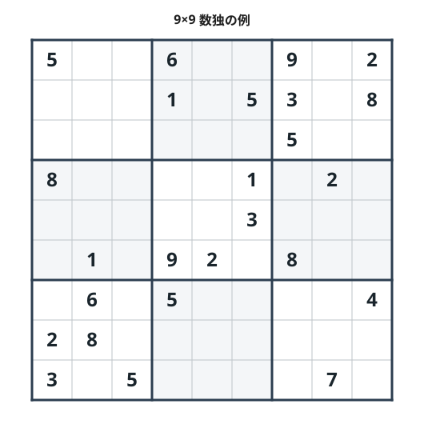

==========================================
序章 ひとつの問題、たくさんの解き方
==========================================

次の9×9数独を考えてみます。

やることは、空きマスへ1から9を入れ、各行、各列、各3×3ブロックで数字を重複させないことです。
数独としての規則は、どの章でも変わりません。変わるのは、盤面をプログラムへ渡す前に、何として
捉え直すかです。

以下に出てくる手法の名前は、ここで覚える必要はありません。まずは、同じ「マスへ数字を置く」
という操作を、章ごとに別の形へ置き換えることだけ確認します。

空きマスを再帰関数が試す候補にすれば、:doc:`バックトラック <01-backtracking>` で探索できます。
値が未定の変数と規則にすれば、:doc:`論理プログラム <03-prolog>` や
:doc:`制約ソルバー <05-constraint-programming>` へ渡せます。「2行3列に1を置く」を真偽変数に
すれば、:doc:`論理式 <07-sat>`、:doc:`線形等式 <11-integer-programming>`、
:doc:`罰則項 <13-qubo>` を作れます。盤面を状態とみなせば、数字を一つ置く操作は
:doc:`状態遷移 <10-model-checking>` になります。

このシリーズの主題は、数独そのものより、この **翻訳** の違いです。同じ規則が、探索木、関係、
論理式、状態、エネルギーなどへ姿を変えます。各章では翻訳後の問題を実際のソルバーへ渡し、得た
結果をもう一度数独の盤面へ戻します。

共通にするもの
================

Pythonを使う章もあれば、Prolog、MiniZinc、ASPの入力言語、
モデル検査器の記述言語を使う章もあります。手法を自然に表せる実装を優先します。

入力と結果の意味は、できるだけそろえます。

入力盤面
   9×9または4×4の盤面を使います。空きマスは ``0`` または ``.`` です。4×4を使う章では、
   9×9へそのまま広げると重くなるなど、盤面を小さくした理由を本文に記します。

``solved``
   初期配置を保ち、すべての行、列、ブロックを満たす完成盤面を一つ以上得た状態です。掲載する
   盤面は共通の検証器でも確認します。``solved`` だけでは、その盤面が唯一の解だとは分かりません。

``unsat``
   条件を満たす完成盤面が存在しないと判定した状態です。候補を漏れなく調べた、論理式が充足不能に
   なった、最適値の下限まで証明した、などの根拠が必要です。有限回試して解が見つからなかっただけ
   では ``unsat`` にしません。

``unknown``
   その実行からは結論を出せない状態です。制限時間や反復上限へ達した場合、近似的な探索で解を
   見つけられなかった場合、ソルバーが最終判定を返さなかった場合が含まれます。``unknown`` は
   「おそらく解なし」という意味ではありません。

この三つを分けると、ソルバーが盤面を返したかどうかと、解の存在についてどこまで証明できたかを
混同せずに済みます。

各章で見ること
================

通常問題に加えて、解がない問題や解が複数ある問題も使います。結果を読むときは、次の軸を
確認します。

ここでいう **完全性** は、解が存在するとき、定めた探索を完了すれば少なくとも一つを
見つけられる性質です。返された一つの盤面が正しいという意味ではありません。

.. list-table:: 章をまたいで確認する項目
   :header-rows: 1
   :widths: 25 75

   * - 比較する項目
     - 確認すること
   * - 翻訳
     - マスや候補を何に置き換え、行、列、ブロックの規則をどう表すか
   * - 解の正しさ
     - 返された値から完成盤面を復元でき、共通検証器が受理するか
   * - 完全性
     - 解が存在するとき、定めた探索を完了すれば少なくとも一つを見つけられるか
   * - 解なし
     - ``unsat`` を証明できるか、見つからないときは ``unknown`` に留まるか
   * - 一意性
     - 最初の解とは異なる二解目を探すか、探索を終えるか、解数を数えられるか
   * - 列挙と数え上げ
     - 解を一つ得るほかに、全解を並べたり、盤面数だけを求めたりできるか
   * - 再現性
     - 乱数、シード、反復上限、処理系の版によって結果や探索順が変わるか

解の正しさは盤面の検証で確認します。完全な方法でも、一解を得た時点で実行を止めれば一意性は
未判定です。反対に、すべての候補を調べる保証のない探索方法でも、異なる二盤面を実際に得て
両方を検証できれば、その問題が一意解でないことは分かります。

解き方の見取り図
==================

同じ定式化でも、どのソルバーでどこまで計算するかによって保証が変わります。本編は、数独を
何に翻訳して計算するかに沿って五つのPartに分けます。

.. list-table:: 本編の構成
   :header-rows: 1
   :widths: 16 44 40

   * - Part
     - 数独の見方
     - 扱う方法
   * - I 探索の仕組みを組み立てる
     - 候補を分岐させ、行き詰まった枝から戻る探索として扱う
     - バックトラック、Exact Cover
   * - II 規則を宣言して解く
     - 値が未定の変数、関係、制約、禁止条件として規則を書く
     - Prolog、miniKanren、制約プログラミング、ASP
   * - III 論理式と状態を扱う
     - 真偽や整数の論理式、解集合を表すグラフ、状態遷移へ変換する
     - SAT、SMT、BDD、モデル検査
   * - IV 数式と目的関数へ変換する
     - 線形等式、多項式方程式、罰則の最小化として表す
     - 整数計画法、Boolean Gröbner基底、QUBO
   * - V 反復計算で候補を探す
     - 射影やメッセージ更新を繰り返し、有効な完成盤面を探す
     - 反復射影、因子グラフ

Partの区分は、各章の中心となる見方を示すもので、手法を排他的に分類するものではありません。
Exact Coverの探索にもバックトラックを使い、モデル検査の内部でSATを使う場合があります。整数計画は
最適化の形式を使いながら、ソルバーが探索を完了すれば解なしも判定できます。QUBOではゼロエネルギーと
完成盤面を対応させられても、有限回のサンプリングだけでは最低値を証明できません。方法の名前だけで
保証を決めず、モデル、ソルバー、終了条件を一緒に見ます。

各章の読み方
============

各章は、その手法を知らないところから読めるように、小さな例から始めます。その後、数独のマスと
規則を翻訳し、実行できるコードで通常問題を解きます。厳密に判定できる方法では解なし問題を、複数の
解を扱える方法では複数解問題も試します。内部アルゴリズムの
用語は、コードや結果を理解するために必要な箇所で説明します。補足の数式や専門用語を飛ばしても、
後の節を読める構成にしています。
