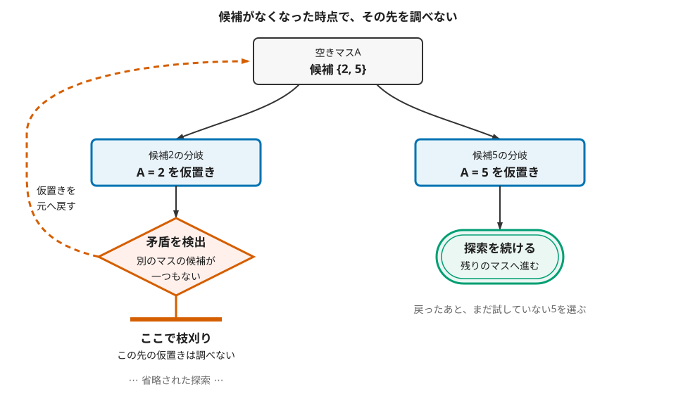
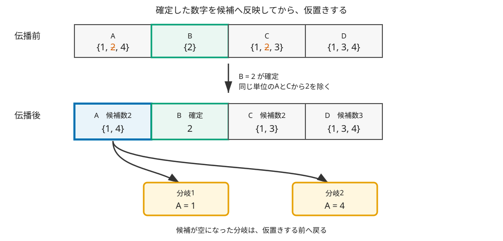

====================================
第1章 バックトラックで数独を解く
====================================

数独を解いていて、あるマスに2と5のどちらも入りそうな場面を考えてみます。まず2を
仮置きし、その先でどの数字も入らないマスができたら、仮置きする前の盤面へ戻ります。
次は5を試します。このように、候補を仮置きし、行き詰まったら戻って別の候補を試す方法が
`バックトラック <https://ja.wikipedia.org/wiki/%E3%83%90%E3%83%83%E3%82%AF%E3%83%88%E3%83%A9%E3%83%83%E3%82%AD%E3%83%B3%E3%82%B0>`_
です。

盤面を直接操作する短いPythonプログラムで、まず単純な実装を動かします。次に、マスの候補を
使って余分な仮置きを減らします。

候補を試し、行き詰まったら戻る
==================================

一つの空きマスを選んだとき、処理は次の三段階になります。

1. 同じ行、列、3×3ブロックを調べ、そのマスに入る候補を求めます。
2. 候補を一つ仮置きし、次の空きマスへ進みます。
3. 先へ進めなくなったら仮置きを消し、残りの候補を試します。

「先へ進めない」のは、たとえば空きマスの候補が一つもなくなったときです。その盤面へ
これ以上数字を足しても完成しないため、先の調査はせずに戻れます。このように、正解に
つながらないと分かった範囲を調べずに済ませることを **枝刈り** と呼びます。

   候補が空になった時点で左の枝を打ち切ります。仮置きを戻したあと、まだ試していない
   5の枝へ進みます。

プログラムでは、同じ探索関数を空きマスごとに呼び出して、この流れを表せます。
呼び出した関数から戻ると、直前のマスで別の候補を試せます。
探索関数の一回の呼び出しが、探索木の一つの盤面に対応します。候補を置いて同じ関数を呼ぶと
子の盤面へ進み、その呼び出しから戻ると親の盤面へ戻ります。

.. admonition:: 補足
   :class: note

   この流れは **探索木** としても見られます。根は最初の盤面、辺は一回の仮置き、葉は
   完成盤面または行き詰まった盤面です。一本の枝を先に進み、失敗したら親へ戻るので、
   探索順序は深さ優先探索になります。

   空きマスが :math:`m` 個あり、候補を何も減らせないと仮定すると、割り当ては最大で
   :math:`9^m` 通りあります。これは粗い上限です。実際には、数独の規則による枝刈りで
   多くの組合せを調べずに済みます。

数独に当てはめる
==================

サンプルコードでは、盤面を81個の整数を並べたものとして持ち、空きマスを ``0`` で表します。
探索中に必要なのは、次の四つです。

空きマスを選ぶ
   まだ ``0`` のマスから、次に調べる一つを選びます。

候補を求める
   1から9のうち、同じ行、列、3×3ブロックで使われていない数字を集めます。

仮置きする
   候補を盤面へ書き込み、残りの空きマスを同じ方法で調べます。

完成を確かめる
   空きマスがなくなったら、完成した盤面を解として保存します。

初期配置の数字は候補に含まれないので、探索中に書き換わりません。数独の規則を満たす候補を
すべて試していけば、解がある場合は完成盤面へたどり着きます。

候補を集合で書くこともできます。行 :math:`r` ですでに使われた数字を :math:`R_r`、列
:math:`c` で使われた数字を :math:`C_c`、そのマスを含むブロックで使われた数字を
:math:`B_{r,c}` とします。マス :math:`(r,c)` の候補 :math:`D_{r,c}` は次のとおりです。

.. math::

   D_{r,c} = \{1,\ldots,9\} \setminus
             \left(R_r \cup C_c \cup B_{r,c}\right)

つまり、1から9までの集合から、同じ行、列、ブロックですでに使われた数字を取り除いています。

.. admonition:: 補足
   :class: note

   制約充足問題（CSP）の言葉では、81個のマスが **変数**、各マスの候補が **値域**、
   行、列、ブロックで数字を重複させない規則が **制約** です。この用語を知らなくても、
   以下のコードは盤面と候補だけで読むことができます。

まずは単純に実装する
======================

最初の実装では、左上から見て最初の空きマスを選ぶようにします。そのマスに入る数字を小さい順に
試します。

.. include:: ../examples/01-backtracking/solve.py
   :code: python
   :start-after: # BEGIN article-naive-search
   :end-before: # END article-naive-search

``naive_search()`` の戻り値は、盤面が解かどうかではなく、指定した個数の解が集まったかを表します。
``True`` が返ると、呼び出し元も残りの候補を試さず、再帰呼び出しを順に終了します。

この中で大切なのは、``naive_search()`` から戻った後の ``board[position] = 0`` です。仮置きした数字を
消すことで、次の候補を同じ盤面から試せます。

``board.index(0)`` が失敗した場合は、空きマスが残っていないことを表しています。そこでは、その盤面を解として保存します。
反対に、候補が一つもなければ ``for`` の中へ入らず、呼び出し元へ戻ります。これが、この
実装で行き詰まりを見つける仕組みです。

候補を先に整理する
====================

単純な実装では、仮置きするたびに行、列、ブロックを調べ直していました。もう少し早く行き詰まりを
見つけるため、改良版では各マスに「まだ入りうる数字」を持たせます。

たとえば、あるマスが2に決まったら、同じ行、列、ブロックにあるほかのマスから2を除きます。
その結果、候補が一つだけになったマスも確定します。確定した数字を周囲の候補へ順に反映する
処理を、ここでは **候補伝播** と呼びます。

   確定した数字を候補へ反映してから、仮置きするマスを選びます。

サンプルコードでは、1から9までの候補を一つの整数のビットで表します。``assign`` は、選んだ
数字以外をそのマスの候補から除きます。候補を除く ``eliminate`` は、同じ行、列、ブロックへ
変化を伝えます。

数字 :math:`d` に :math:`2^{d-1}` のビットを割り当てると、候補集合を一つの整数にまとめられます。
たとえば候補が1、2、4なら、対応するビットを立てた ``0b000001011`` です。候補数は
``bit_count()`` で数えられます。

右端から、数字1、2、3、4、…に対応します。したがって ``0b000001011`` では、右から1番目、
2番目、4番目のビットが1です。ビット表現は候補集合を一つの整数へ収めるための実装上の選択で、
バックトラックや候補伝播そのものに必須ではありません。

.. include:: ../examples/01-backtracking/solve.py
   :code: python
   :start-after: # BEGIN article-propagate
   :end-before: # END article-propagate

コード中の ``other_bits & -other_bits`` は、立っているビットを下位から一つ取り出す書き方です。
ここでは、除く候補を一つずつ ``eliminate`` へ渡すために使っています。

候補伝播では、次の二つを繰り返します。

- あるマスの候補が一つになったら、同じ行、列、ブロックの候補からその数字を除きます。
- ある数字を置ける場所が行、列、ブロックの中で一つだけなら、そのマスを確定します。

人間向けの数独解法では、前者を「裸のシングル」、後者を「隠れたシングル」と呼びます。本章の
プログラムは、この二つを候補が変わるたびに自動で適用します。

途中で候補が空になれば、その仮置きでは完成できません。そこで探索を止め、直前の盤面へ
戻ります。なお、この実装方法は、Peter Norvigによる数独ソルバの解説を参考にしています
:cite:labelpar:`norvig2006sudoku`。

候補の少ないマスから試す
==========================

候補伝播を終えても複数の候補が残ったら、どこか一つを選んで仮置きします。改良版では、
候補が最も少ないマスを選びます。候補が2個のマスなら分岐は2通りですが、候補が5個のマスを
選ぶと5通りを試すことになるためです。この選び方はMRV（Minimum Remaining Values）とも
呼ばれます。

マス :math:`p` の候補集合を :math:`D(p)` と書けば、選び方は次の式で表せます。

.. math::

   p^* = \underset{p:\,|D(p)|>1}{\operatorname{arg\,min}}\ |D(p)|

候補が二つ以上残るマスの中から、候補数 :math:`|D(p)|` が最小のものを選ぶ、という意味です。

.. include:: ../examples/01-backtracking/solve.py
   :code: python
   :start-after: # BEGIN article-mrv-search
   :end-before: # END article-mrv-search

``unresolved`` の要素は ``(候補数, マス番号)`` です。Pythonはタプルを左の要素から比較するため、
``min(unresolved)`` が候補数の最も少ないマスを選びます。``context`` には初期盤面や
探索回数など、各呼び出しで共有する情報をまとめています。分岐ごとに候補一覧
``state`` をコピーするため、失敗した分岐で消した候補が別の分岐へ混ざりません。

実行する
========

サンプルプログラムは ``examples/01-backtracking/solve.py`` に実装されています。詳しい実行手順やコマンドラインオプションについては ``examples/01-backtracking/README.md`` を参照してください。

以下では、単純なバックトラック手法（Naive）と候補伝播を組み合わせた手法（propagate）で標準問題を解いた結果を比較します。

通常問題の結果
--------------

比較においては次の一意解問題を使います。``0`` は空きマスです。候補伝播だけでは完成しないため、
改良版でも仮置きと巻き戻しが発生します。

.. include:: ../fixtures/standard-9x9.sdk
   :literal:

この問題を二つの方法で解くと、単純な実装（Naive）では最初の解を得るまでに探索関数を22,530回呼び出し、22,473回の巻き戻しが発生します。一方、候補伝播とMRVを組み合わせた手法では、探索関数の呼び出しは6回、仮置きは7回、巻き戻しは2回で済みます。

この比較から、候補伝播や候補の少ないマスを優先する工夫が、バックトラックにおける分岐数を大幅に削減していることが確認できます。

解がない場合と、解が複数ある場合
====================================

バックトラックは、完成盤面を一つ見つけるだけでなく、解の非存在や複数解の有無も判定できます。

初期配置で制約の矛盾がない盤面であっても、候補伝播を進める過程でどの数字も入れられない空きマスが生じ、かつ他の分岐候補も残らない場合があります。全候補の探索を終えても解に達しない場合、解なし（unsat）と確定します。

また、探索の上限を2以上に設定して実行した際、互いに異なる完成盤面が2つ見つかれば、その問題は一意解ではなく複数解を持つと判断できます。

この方法で分かること
======================

この実装は、数独の規則に合う候補を漏れなく試します。すべての候補を調べ終えれば、解が
ない場合は ``unsat`` と判定できます。最初の解で止めずに二つ目も探せば、一意解かどうかも
確認できます。数独にバックトラックを使う方法は、ほかの解法との比較研究でも扱われています
:cite:labelpar:`chi2012sudoku`。

候補が空になった場合や、ある数字を置ける場所が行、列、ブロックからなくなった場合だけ
枝を打ち切るため、正しい完成盤面につながる候補は捨てません。この条件を守って全候補を
調べることが、解なしまで判定できる理由です。

候補伝播と「候補の少ないマスから試す」工夫は調べる量を減らしますが、問題によっては多くの
仮置きが必要で、短時間で終わるとは限りません。

参考文献
========

.. include:: ../bibliography/generated/01-backtracking.rst
