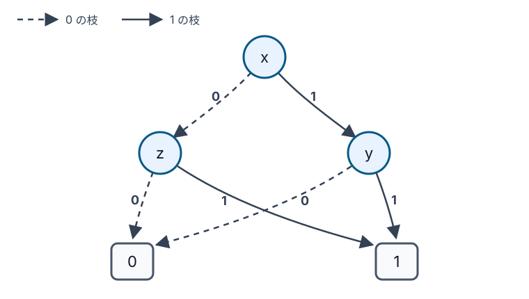

=====================================
第9章 BDDで数独の解を数える
=====================================

一つの完成盤面を探すだけでなく、盤面に解が何個あるかを最初から知りたい場合があります。
すべての候補の組合せを一つのグラフへまとめておき、グラフから解の個数を読み取る方法です。

この章では、`二分決定図（BDD） <https://en.wikipedia.org/wiki/Binary_decision_diagram>`_ を
使います。完成盤面を一つずつ保存するのではなく、同じ残り方をする選択を同じ部分グラフへ
合流させます。数独の規則をBDDへ変換した後、初期配置を追加して解数を求め、具体的な
盤面を取り出します。実装で使うのは順序付きで縮約されたBDD（ROBDD）です。以後はこれを
単にBDDと表記します。

小さな論理式をグラフにする
==============================

まず、三つの真偽値 :math:`x,y,z` を使い、次の処理を考えます。

.. math::

   f(x,y,z)=(x\land y)\lor(\lnot x\land z)

:math:`x` が真なら結果は :math:`y`、偽なら結果は :math:`z` です。プログラムの条件式で書けば
``y if x else z`` に当たります。この式をBDDにすると、最初に :math:`x` を調べ、値に応じて
:math:`y` または :math:`z` へ進みます。

   破線は変数を0（偽）、実線は1（真）にした枝です。異なる枝が同じ終端を共有しています。

丸は、そこに書かれた変数を調べる場所です。四角い0へ着けば式は偽、1へ着けば真です。
たとえば :math:`x=1,y=1` なら1へ着きます。この経路では :math:`z` を調べません。結果に関係
しないためです。したがって、この一本の経路は :math:`z=0` と :math:`z=1` の二つの割り当てを
まとめて表しています。

式を真にする部分経路は二本あります。

* :math:`x=1,y=1` なら、:math:`z` は0と1のどちらでもよいため二モデルです。
* :math:`x=0,z=1` なら、:math:`y` は0と1のどちらでもよいため二モデルです。

合わせて :math:`2+2=4` モデルになります。

コードでは、`dd <https://github.com/tulip-control/dd>`_ の純Python実装 ``dd.autoref`` を
使います。変数を宣言した順が、グラフ内で変数を調べる順になります。
``&``、``|``、``~`` はPythonの真偽値をその場で計算する演算ではなく、BDD上のAND、OR、NOTを
作る演算です。

.. include:: ../examples/10-bdd-model-counting/small_bdd.py
   :code: python
   :start-after: # BEGIN article-small-bdd
   :end-before: # END article-small-bdd

ROBDDの **順序付き** とは、根から終端へ向かうどの経路でも、変数が宣言順に現れることです。
経路によって不要な変数を飛ばすことは
ありますが、宣言順を逆向きにはたどりません。

**縮約** では、次の二つを行います。

* 0の枝と1の枝が同じ行き先になるノードを取り除きます。その変数を調べても結果が変わらない
  ためです。
* 同じ変数を調べ、0と1の行き先も同じ二つのノードを一つにまとめます。図の0終端と1終端も、
  複数の枝から共有されています。

変数順を固定すれば、同じ論理関数から得られるROBDDは同型を除いて一意になります。縮約と共有を
使った論理演算や、その性質はBryantの論文でまとめられています。:cite:labelpar:`Bryant1986BDD`

変数順で大きさが変わる
========================

同じ論理式でも、変数を調べる順によってグラフの大きさは変わります。先ほどの式を二通りの順で
作ると、次の結果になりました。

.. code-block:: console

   $ uv run --with-requirements examples/10-bdd-model-counting/requirements.txt \
       python examples/10-bdd-model-counting/small_bdd.py

.. include:: ../outputs/10-bdd-model-counting-small.txt
   :literal:

``x,y,z`` の順なら、図にある変数ノードは三つです。``y,z,x`` の順では四つに増えました。どちらも
同じ式を表すので、式を真にする割り当ての個数（モデル数）は四つのままです。三変数では小さな差ですが、変数が増えるとBDDの
大きさが桁違いになることもあります。:cite:labelpar:`Bryant1992OBDD`

ライブラリによっては、構築中に変数順を入れ替える動的並べ替えも利用できます。この章では、
候補の並べ方と結果の関係が隠れないよう、固定した順序を使います。最適な順を自動的に見つけられる
ことは前提にできません。

モデル数を数える
==================

論理式を真にする変数の割り当てを **モデル** と呼び、その個数を求める問題を **モデル数え上げ**
と呼びます。命題論理式を対象にする場合は
`#SAT <https://en.wikipedia.org/wiki/Sharp-SAT>`_ とも呼ばれます。SATが「一つ以上あるか」を
答えるのに対し、#SATは「何個あるか」を答えます。:cite:labelpar:`Gomes2009ModelCounting`

BDDでは、各ノードについて0側と1側のモデル数を足せます。途中で変数を飛ばす枝には、飛ばした
変数1つにつき2倍（0と1の2通り）を掛け合わせます。先ほどの図なら、:math:`x=1,y=1` から :math:`z` を飛ばして
1終端へ着く経路は二モデルです。``dd`` の ``count`` は、この省略も含めて数えます。

BDDによる数え上げは、#SATという問題を別物に変えるわけではありません。ここでは数独の論理式を
いったんBDDへコンパイルし、そのBDD上で正確なモデル数を計算しています。BDDの構築自体が難しい
こともあり、最悪の場合はグラフが指数的に大きくなります。作れた後の問い合わせが扱いやすい点と、
作るのが常に容易であることは別です。このように、重い処理を先に行って問い合わせや変換を
しやすい表現へ移す考え方は、知識コンパイルと呼ばれます。:cite:labelpar:`DarwicheMarquis2002KnowledgeCompilation`

数独を64個の真偽変数で表す
================================

ここでは9×9ではなく、4×4の数独を使います。各ブロックは2×2で、各行、列、ブロックに1から4が
一度ずつ入ります。4×4でも、候補変数、``exactly-one`` 制約、初期配置、数え上げという構造は
9×9と同じです。

4×4を選ぶ理由は、BDDの構築に必要な計算量とメモリです。候補変数は4×4なら
:math:`4\times4\times4=64` 個ですが、9×9なら :math:`9\times9\times9=729` 個になります。
さらに、BDDのノード数は制約数だけでなく変数順にも強く左右されます。素直な順序と純Python実装で
9×9まで広げても、記事のサンプルとして安定して再現できるとは限りません。この章では、BDDの性質と
正確な全解数を小さい盤面で確かめることを優先します。

行 :math:`r`、列 :math:`c` のマスに数字 :math:`d` を入れる候補を、真偽変数
:math:`x_{r,c,d}` にします。4×4では、次の四種類の条件をそれぞれ16組、合計64組作ります。
たとえば :math:`x_{2,3,4}` は「2行3列のマスへ4を入れる」候補です。候補変数が64個であることと、
``exactly-one`` 制約が64組あることは別の数え上げで、この例ではたまたま同じ個数になります。

* 一つのマスには、数字が一つだけ入ります。
* 一つの行には、各数字が一度だけ現れます。
* 一つの列には、各数字が一度だけ現れます。
* 一つの2×2ブロックには、各数字が一度だけ現れます。

どの組も「四候補のうちちょうど一つが真」という条件です。候補を
:math:`v_1,\ldots,v_4` とすると、次の式になります。

.. math::

   (v_1\lor v_2\lor v_3\lor v_4)
   \land
   \bigwedge_{1\leq i<j\leq4}(\lnot v_i\lor\lnot v_j)

前半は少なくとも一候補を選ぶ条件です。後半は、どの二候補も同時には選べない条件です。この二つを
合わせて ``exactly-one`` にします。

.. include:: ../examples/10-bdd-model-counting/bdd_utils.py
   :code: python
   :start-after: # BEGIN article-exactly-one
   :end-before: # END article-exactly-one

すべての規則を一つのBDDへコンパイルする
============================================

変数は、マスごとに四候補を並べる「マス優先」の順に宣言します。数字ごとに全マスを並べる順序なども
選べますが、ここでは最初の四変数が ``x_1_1_1`` から ``x_1_1_4`` になります。SATへの変換でも
使われる候補表現ですが、この章では連言標準形
（CNF）をSATソルバーへ渡すのではなく、論理演算を行いながらROBDDを組み立てます。

.. include:: ../examples/10-bdd-model-counting/solve.py
   :code: python
   :start-after: # BEGIN article-rules
   :end-before: # END article-rules

``rules`` は初期配置を一つも含まない、4×4数独そのもののBDDです。このBDDは一度だけ作ります。
今回の変数順では、``rules`` の根から到達できる非終端ノードは2,256個でした。空盤面の完成形は
288個です。288盤面を別々に並べたものではなく、途中の選択を共有する一つのグラフになっています。

空盤面について解数のみを確認した結果です。

.. include:: ../outputs/10-bdd-model-counting-empty.txt
   :literal:

``rule_nodes`` と ``solution_count`` は別の量です。前者は規則を表すグラフの非終端ノード数、後者は
その規則を満たす真偽割り当ての個数です。今回の符号化では、一つの完成盤面につき64候補の真偽が
すべて決まります。補助変数も使っていないため、モデル数をそのまま完成盤面数として読めます。
``query_nodes`` は、``rules`` に初期配置も加えた問い合わせBDDの非終端ノード数です。空盤面では
初期配置を何も加えないため、``rule_nodes`` と同じ値になります。

初期配置でBDDを絞り込む
========================

初期配置 ``1...`` があれば、左上の候補 ``x_1_1_1`` を真にします。ほかの初期配置も同様です。
初期配置の式と ``rules`` の論理積を取ると、その問題に合う完成盤面だけを表すBDDになります。

.. include:: ../examples/10-bdd-model-counting/solve.py
   :code: python
   :start-after: # BEGIN article-givens
   :end-before: # END article-givens

ここでは、初期配置ごとに数独の64組の規則を組み直していません。先に作った ``rules`` を共有し、
与えられた数字だけを加えます。同じ規則に対して多くの初期配置を調べるなら、この再利用がBDDを
使う利点になります。数独生成では、ヒントを一つ外した盤面の解数を何度も問い合わせる、といった
使い方が考えられます。

一方で、各問い合わせで得られるBDDが必ず小さいとは限りません。この実装では同じBDDオブジェクトを
使うため、同じ部分関数は再利用されますが、初期配置との論理積に必要な処理は行われます。
「一度コンパイルすれば、その後は何を聞いても一定時間」とは限りません。

個数と完成盤面を取り出す
============================

``count`` には、対象のBDDと全変数数64を渡します。変数を飛ばした枝も含めたモデル数が返ります。
解が0個なら ``unsat``、1個以上なら ``solved`` と表示します。

具体的な盤面が必要なときは、``pick_iter`` でモデルを列挙します。``care_vars`` に64変数すべてを
指定し、飛ばされた変数にも真偽値を補います。その後、各マスで真になった候補を数字へ戻し、
完成盤面を検証します。

.. include:: ../examples/10-bdd-model-counting/solve.py
   :code: python
   :start-after: # BEGIN article-solving
   :end-before: # END article-solving

``solution_count`` は全解数ですが、盤面の表示は ``--limit`` で指定した個数までです。解数を得る
ために、288盤面すべてをPythonのリストへ展開する必要はありません。

一意解、解なし、複数解を確かめる
====================================

詳しい実行手順やオプションについては :repo-file:`examples/10-bdd-model-counting/README.md` を参照してください。

一意解問題ではモデルカウント結果が1（``solution_count: 1``）となり、他手法のように初解の除外制約を追加して再探索することなく、BDDの構造から直接一意性が確定します。

矛盾問題（解なし）では、論理式が恒偽（常に偽）となってROBDDが0終端ノードのみで構成されます。ノード数・モデル数がともに0となることから、構成された制約を満たす割当が存在しないこと（解なし）が判定されます。

複数解問題ではモデルカウント結果が2（``solution_count: 2``）となり、解空間全体を数え上げた結果として正確に二つの解が存在することが確認できます。空盤面であれば、全解数288という値が同様に算出されます。

この方法で分かること
======================

この実装が作る各モデルでは、各マスの候補がちょうど一つ真になり、行、列、ブロックでも各数字の
候補がちょうど一つ真になります。そのため、モデルから必ず4×4数独の完成盤面を復元します。
反対に、数独の完成盤面からは、置かれた数字の候補だけを真にする一つのモデルが決まります。この
一対一の対応があるため、``count`` の値は完成盤面の個数です。

数え上げと列挙は明確に区別します。``count`` はグラフをたどって個数を計算し、``pick_iter`` は必要な
モデルだけを取り出します。0モデルなら解なし、1モデルなら一意解、2以上なら複数解です。いずれも
乱数には依存しません。ただし、複数解のうちどの盤面が先に列挙されるかやBDDの内部番号は、
ライブラリの版や変数順で変わる可能性があります。

BDDは全解を圧縮して保持し、同じ規則への問い合わせを繰り返せる点が特徴です。論理回路の検証や
状態集合の表現にも使われてきました。:cite:labelpar:`Bryant1986BDD` ただし、圧縮率は問題の構造と変数順に
左右されます。9×9数独を実用的に扱うには、変数順、制約を結合する順、動的並べ替え、CUDDなどの
高性能バックエンドを検討する必要があります。この4×4実装のノード数や実行時間から、9×9での
性能を推定することはできません。

参考文献
========

.. include:: ../bibliography/generated/10-bdd-model-counting.rst
