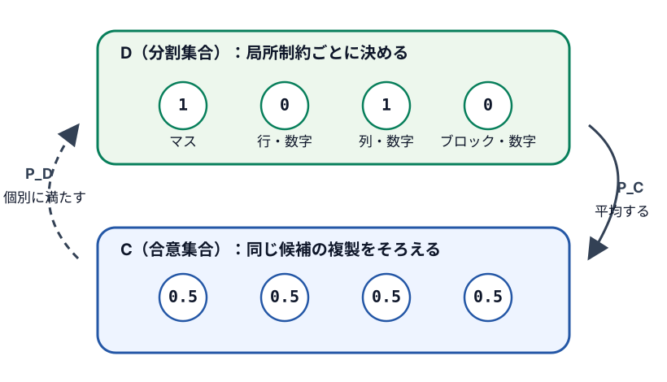

====================================
第14章 反復射影で数独を解く
====================================

数独の候補を、0か1に決める前の実数として持ってみます。あるマスの四候補が
``[0.1, 0.7, -0.2, 0.3]`` なら、値が0.7で最も大きい2番目の候補を1にし、残りを0にすると、
「一つのマスに数字が一つ」という規則を満たせます。今度は行の規則に合わせて候補を直すと、
先ほど決めたマスが崩れるかもしれません。それでも二種類の修正を繰り返し、すべての規則を
同時に満たす点を探します。

このように、点を制約集合内の最も近い点へ移す操作を繰り返す方法を
`反復射影 <https://en.wikipedia.org/wiki/Projections_onto_convex_sets>`_ と呼びます。

数独は1から9（または1から4）の整数を入れる離散問題ですが、反復射影では三つのステップで
扱います。まず各候補を0か1の二値ではなく実数へ拡張し、連続空間上の点として持ちます。次に
二種類の射影を繰り返し、すべての制約を同時に満たす点へ近づけます。最後に、各マスで最も
大きい候補を1、残りを0として離散的な盤面へ戻します。途中の実数値は、候補がどれだけ有力か
を表す作業用の値であり、最終的な整数の答えそのものではありません。

二本の直線へ順番に射影する
================================

最初に、平面上の点 :math:`(x,y)` を二本の直線へ移してみます。一つ目の集合 :math:`A` は
:math:`x` 軸、二つ目の集合 :math:`B` は直線 :math:`y=x` です。共通部分は原点だけです。

点から集合内の最も近い点へ移す操作が **射影** です。:math:`x` 軸への射影は :math:`y` を0に
します。直線 :math:`y=x` への射影では、二つの座標を平均します。

.. math::

   P_A(x,y)=(x,0), \qquad
   P_B(x,y)=\left(\frac{x+y}{2},\frac{x+y}{2}\right)

.. include:: ../examples/13-iterative-projection/small_projection.py
   :code: python
   :start-after: # BEGIN article-small-projections
   :end-before: # END article-small-projections

:math:`P_A` と :math:`P_B` を順番に適用すると、点は次のように動きました。

.. code-block:: console

   $ uv run --with-requirements examples/13-iterative-projection/requirements.txt \
       python examples/13-iterative-projection/small_projection.py

.. include:: ../outputs/13-iterative-projection-small.txt
   :literal:

一回目の交互射影後は :math:`(1,1)`、二回目は :math:`(0.5,0.5)` です。原点に向かって座標が半分ずつに
なっています。これは二本の直線についての結果です。一般の閉凸集合にも交互射影の収束理論が
ありますが、数独で使う「候補の一つだけが1」という集合は凸集合ではありません。候補0と候補1を
結ぶ途中の点は、どちらの候補も0と1の間になり、数独の割り当てではないためです。非凸な集合では、
同じ二つの射影を使っても交点へ収束する保証はありません。:cite:labelpar:`ChiLange2012SudokuProjection`

局所制約を分けてから合意させる
====================================

数独には、マス、行、列、ブロックの規則があります。各規則への射影は個別に書けます。そこで、
すべてを一度に扱う代わりに「行 :math:`r`、列 :math:`c` に数字 :math:`d` を置く候補」
:math:`x_{r,c,d}` を四つ複製します。一つはマスの規則、残りは行、列、ブロックの規則に使います。

四種類の複製を別々に修正すれば、各局所規則を満たす点は構成されます。ただし、同じ候補についてマス側は1、
行側は0と主張することがあります。四つの値を平均して同じ値へそろえれば、今度は局所規則が
崩れます。局所規則を満たす集合を :math:`D`、四つの複製が一致する集合を :math:`C` とします。
それぞれへの射影を :math:`P_D`、:math:`P_C` と書きます。この分け方はDivide and Concurと
呼ばれます。:cite:labelpar:`GravelElser2008DivideConcur` 詳細は
`原論文の公開版 <https://arxiv.org/abs/0801.0222>`_ でも確認できます。

   図の数値は一候補についての例です。:math:`P_C` は四つを平均し、:math:`P_D` は各複製を
   担当する局所制約へ戻します。破線と実線は二種類の射影を区別しています。

4×4数独なら、元の候補配列は :math:`4\times4\times4=64` 要素です。四種類に複製するので、
反復中は :math:`4\times4\times4\times4=256` 個の実数を持ちます。配列の先頭の添字を、
マス、行、列、ブロックのどの規則を担当するかに使います。

.. list-table:: 候補配列 ``values[k, r, c, d]`` の四つの軸
   :header-rows: 1
   :widths: 15 35 50

   * - 軸
     - 意味
     - 4×4での値
   * - ``k``
     - 担当する規則
     - マス、行、列、ブロックの4種類
   * - ``r``
     - 行
     - 0から3
   * - ``c``
     - 列
     - 0から3
   * - ``d``
     - 数字の候補
     - 0から3。盤面の数字1から4に対応

局所制約への射影
==================

:math:`P_D` は四つの複製を互いに相談させず、それぞれの局所制約だけを満たします。

マスの複製
   各マスで四候補の最大値を一つ選び、そこを1、残りを0にします。初期配置のあるマスは、
   最大値に関係なく与えられた数字を選びます。

行の複製
   行と数字を一組にし、その数字を置く列を一つ選びます。

列の複製
   列と数字を一組にし、その数字を置く行を一つ選びます。

ブロックの複製
   2×2ブロックと数字を一組にし、その数字を置くマスを一つ選びます。

一要素だけが1で、残りが0の配列を **one-hotベクトル** と呼びます。四候補から最大値を選ぶ処理は、
実数の四次元ベクトルからone-hotベクトルへのユークリッド距離を
最小にする射影です。最大値が同じ候補が複数あれば最も近い点も複数あります。この実装では
`NumPyの argmax <https://numpy.org/doc/stable/reference/generated/numpy.argmax.html>`_ が最初に
見つけた候補を選びます。

.. include:: ../examples/13-iterative-projection/solve.py
   :code: python
   :start-after: # BEGIN article-divide
   :end-before: # END article-divide

初期配置を固定するのはマスの複製だけです。残る三つの複製は、合意射影を通じて同じ値へ近づきます。
二つの集合の交点では四複製が一致するので、初期配置は行、列、ブロック側にも反映されています。

合意集合への射影
==================

:math:`P_C` は、同じ :math:`x_{r,c,d}` に対応する四つの値を平均し、その平均を四複製すべてへ
書き戻します。

.. math::

   \bar{x}_{r,c,d}=\frac{1}{4}
   \sum_{k=0}^{3}x_{k,r,c,d}

.. include:: ../examples/13-iterative-projection/solve.py
   :code: python
   :start-after: # BEGIN article-concur
   :end-before: # END article-concur

平均後の配列は、各候補について四つの値が同じなので :math:`C` に属します。平均値が0か1である
必要はありません。合意することだけを受け持ち、数独の局所規則は :math:`P_D` に任せています。

二つの射影をDifference Mapで組み合わせる
================================================

この実装では、単純に :math:`P_D` と :math:`P_C` を交互適用しません。現在の実数配列を
:math:`x_k` とし、まず :math:`D` へ射影した点 :math:`d_k` を求めます。:math:`d_k` で
:math:`x_k` を反射した点 :math:`2d_k-x_k` を :math:`C` へ射影し、:math:`c_k` とします。
反射とは、:math:`d_k` を鏡の位置として、:math:`x_k` を反対側へ同じ距離だけ移す操作です。

.. math::

   d_k=P_D(x_k), \qquad
   c_k=P_C(2d_k-x_k)

二つの射影結果の差を使い、次の配列を更新します。

.. math::

   x_{k+1}=x_k+\beta(c_k-d_k)

これはDifference Mapの一形態で、relaxed reflect-reflect（RRR）とも呼ばれる更新です。
Difference Mapは、単純な交互射影で起きる停滞への対処として設計されていますが、非凸問題で
必ず交点を見つける保証はありません。:cite:labelpar:`Elser2003DifferenceMap`

停止判定には、:math:`c_k` と :math:`d_k` の各要素の差のうち、絶対値が最大のものを使います。
これをこの章の **残差** :math:`r_k` とします。

.. math::

   r_k=\lVert c_k-d_k\rVert_\infty

残差が0なら :math:`c_k=d_k` です。:math:`d_k` は局所制約を満たす集合 :math:`D` 上にあり、
:math:`c_k` は四複製が合意する集合 :math:`C` 上にあります。二点が一致すれば、その点は
:math:`D\cap C` に属し、局所規則と合意を同時に満たします。そこから完成盤面を取り出せます。
計算機では丸め誤差があるため、
``tolerance`` 以下で停止します。停止後にも盤面を共通検証器へ渡し、初期配置、行、列、ブロックを
すべて満たす場合だけ ``solved`` とします。

.. include:: ../examples/13-iterative-projection/solve.py
   :code: python
   :start-after: # BEGIN article-difference-map
   :end-before: # END article-difference-map

``beta`` は一回の更新量を調整します。掲載結果では0.5に固定しました。初期配列は標準正規分布から
作るため、``seed`` も結果の一部です。反復上限到達時および残差が閾値以下であっても復元盤面が
検証失敗となった不整合状態においては、一律 ``unknown`` として処理します。

4×4問題を固定条件で実行する
================================

詳しい実行手順やオプションについては ``examples/13-iterative-projection/README.md`` を参照してください。

固定した初期シードとパラメータ（:math:`\beta=0.5` 等）での試行において、43反復で残差が許容誤差（:math:`10^{-8}` 以下）まで減少し、検証を通過する有効な完成盤面が得られます。ただし、この反復数は初期値やパラメータ設定に依存した特定試行の結果です。

収束しなければunknownにする
================================

解が存在しない盤面（あるいは特定の初期値において収束しなかった盤面）に対して実行すると、最大反復上限（2,000反復など）に達しても残差が許容誤差以下まで低下しません。

この場合、結果は ``unsat`` ではなく ``unknown`` となります。反復射影における交点未検出は制約集合の交点非存在（解なし）を厳密に証明するものではなく、単に指定条件で収束しなかった状態を表すためです。

また、複数解を持つ問題で一解が得られた場合であっても、Difference Mapの1回の試行のみから他の解の存在や一意性を確定することはできません。連続空間での反復探索は解の列挙を行わないためです。

この方法で分かること
======================

``solved`` の盤面は、残差による停止判定に加えて共通検証器を通しています。そのため、返した盤面が
数独の規則と初期配置を満たすことは確認できます。途中の実数配列や、残差が小さくなった事実
だけを解として扱ってはいません。

``unknown`` は、指定したシード、パラメータ、反復上限で検証済み盤面を得られなかった状態を示します。
この結果から解の有無や一意性は判定しません。初期配列の生成以外で乱数は使用せず、更新プロセスは
決定論的です。シードを変更した場合は反復数、解出力、収束挙動も変化します。

反復射影では、離散的な数独を実数空間の二つの集合の交点として扱います。射影を個別に記述できれば、
同じ枠組みをほかの制約充足問題にも適用します。:cite:labelpar:`GravelElser2008DivideConcur` 掲載実装は射影で
見つけた候補を検証して採用するヒューリスティックであり、解なしや一意性の判定には、バックトラック、
SAT、SMT、BDD、整数計画法などの厳密解法が必要です。

参考文献
========

.. include:: ../bibliography/generated/13-iterative-projection.rst
