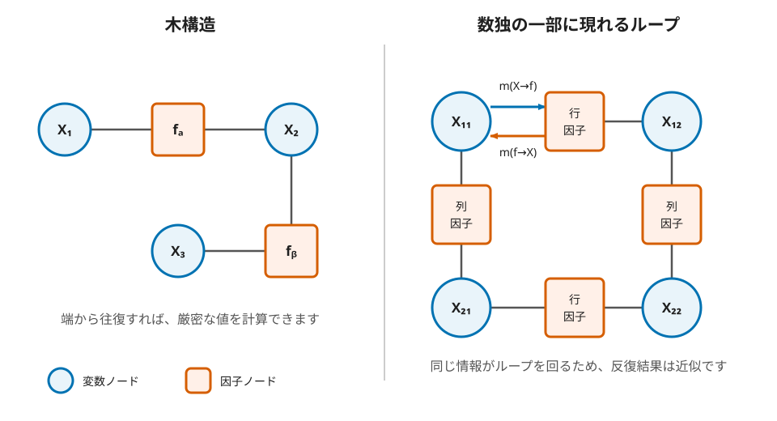

====================================
第15章 因子グラフで数独を解く
====================================

空いている一マスについて、数字1から9の重みを ``[0.05, 0.50, 0.15, 0.05, 0.05, 0.05, 0.05, 0.05, 0.05]`` のように持つことに
します。このマスは同じ行、列、ブロックにいるマスと関係しています。行の側から「2はほかの
マスと両立しにくい」、列の側から「3なら両立しやすい」という情報を受け取って重みを更新します。
今度は更新後の重みを周囲へ返します。このやり取りを繰り返し、各マスで最も重い数字を選びます。
ここではまず、重みを候補同士の有力さを比べる非負の数として読みます。ループのある数独では、
正規化して合計を1にしても、厳密な周辺確率になるとは限りません。

数独では各マスに入る数字が決まっていますが、因子グラフでは各数字の確からしさを表す
重みを持たせます。マスを表すノードと規則を表すノードの間で、周囲の状況に応じたメッセージを
繰り返しやり取りし、重みを更新していきます。最終的に、各マスで最も重みの高い数字を選んで
盤面を復元します。この重みは局所的なやり取りから計算される近似的な確信度であり、厳密な周辺確率や
確定した解そのものではありません。

この関係を図にしたものが
`因子グラフ <https://en.wikipedia.org/wiki/Factor_graph>`_ です。マスを表す **変数ノード** と、
行、列、ブロックの規則を表す **因子ノード** を別の形で描きます。辺で直接つながるのは、変数と
その変数を使う因子だけです。ノード間で重みの配列を交換する計算を **belief propagation** と
呼びます。因子グラフとメッセージ計算は、誤り訂正符号の復号や確率的な推論にも使われています。
:cite:labelpar:`KschischangFreyLoeliger2001FactorGraphs`

変数と規則をノードにする
============================

81マスを :math:`X_1,\ldots,X_{81}` とし、各変数は1から9を
取ります。行、列、3×3ブロックはそれぞれ九つずつあるので、因子ノードは27個です。一つのマスは
行、列、ブロックの三因子につながり、辺は全部で243本になります。

因子は、つながっている九変数がすべて異なれば1、同じ数字があれば0を返します。この関数を
:math:`\psi_u` とします。初期配置を表す関数 :math:`\phi_i` は、指定された数字だけを1とし、
それ以外を0にします。空きマスではどの数字も1です。盤面全体の関数は、これらの積で書けます。

.. math::

   F(\boldsymbol{x})=
   \prod_{i=1}^{81}\phi_i(x_i)
   \prod_{u\in\text{行・列・ブロック}}\psi_u(\boldsymbol{x}_u)

:math:`F(\boldsymbol{x})=1` になる割り当てが数独の解です。大きな関数を、少数の変数だけを見る
小さな関数の積に分けた形が、因子グラフの辺に対応します。

   円は変数ノード、四角は因子ノードです。一つの辺では両方向に別のメッセージを送ります。
   数独では行因子と列因子だけを取り出しても閉じた経路ができます。

メッセージが運ぶもの
======================

一つのメッセージは、数字ごとの非負の重みです。変数 :math:`X` から因子 :math:`f` への
メッセージでは、初期配置の重みと、:math:`f` 以外の隣接因子から届いた重みを掛けます。
次の式の :math:`\propto` は、右辺を計算した後、全候補の合計が1になるよう同じ倍率で割ることを
表します。

.. math::

   m_{X\to f}(d)\ \propto\
   \phi_X(d)
   \prod_{g\in N(X)\setminus\{f\}}m_{g\to X}(d)

:math:`N(X)` は :math:`X` につながる因子の集合です。送り先 :math:`f` から受け取った値を掛け
ないのは、同じ情報をすぐ送り返して二重に数えないためです。

因子から変数へのメッセージでは、周囲の変数を規則どおりに割り当てた場合を調べます。この実装では、
それらの重みを合計する **sum-product** と、最大の重みだけを選ぶ **max-product** の二方式を使います。
この因子では、1から9の順列が「すべて異なる」割り当てです。sum-productでは、対象のマスを数字
:math:`d` にした各割り当ての重みを足します。

次の式の :math:`f(\boldsymbol{x})` は、因子ノード :math:`f` が表す関数で、前節の
:math:`\psi_u` に当たります。:math:`N(f)` は、:math:`f` につながる変数の集合です。

.. math::

   m_{f\to X}(d)\ \propto\
   \sum_{\boldsymbol{x}_{N(f)\setminus\{X\}}}
   f(\boldsymbol{x})
   \prod_{Y\in N(f)\setminus\{X\}}m_{Y\to f}(x_Y)

max-productでは式の和を最大値に置き換えます。どちらも計算後に合計が1になるよう正規化します。

一つの因子だけで計算する
============================

まず、三変数が1から3を一度ずつ取る因子を試します。対象を :math:`X` とし、残る二変数から
``[0.6, 0.3, 0.1]`` と ``[0.2, 0.3, 0.5]`` が届いたとします。三変数への有効な割り当ては
六通りです。各割り当てについて、対象以外の二変数の重みを掛けます。

.. include:: ../examples/14-factor-graph/message_example.py
   :code: python

.. include:: ../outputs/14-factor-graph-message.txt
   :literal:

sum-productで :math:`X=2` とする場合を手で追うと、残る二変数には1と3を異なる順で割り当てます。
正規化前の重みは :math:`0.6\times0.5+0.1\times0.2=0.32` です。同様に :math:`X=1,3` の重みは
0.18と0.24なので、合計0.74で割ると ``[0.243, 0.432, 0.324]`` になります。

二つの方式とも数字2を最も重くしていますが、三つの重みは一致しません。sum-productでは有効な
割り当てを足し、max-productでは最大の割り当てだけを使うためです。この差は、因子グラフの形では
なく、メッセージをまとめる演算から生じます。

使用済みの数字集合ごとに重みをまとめる
========================================

9マスの因子には :math:`9!=362{,}880` 通りの割り当てがあります。メッセージを送るたびに
すべての順列を調べる代わりに、送り先以外のマスへ一つずつ数字を割り当て、使用済みの数字集合ごとに
重みをまとめます。このように途中の計算結果を保存して次の計算に使う方法を **動的計画法** と呼びます。

先ほどの三変数の例で :math:`X=2` とする場合、残る二マスへの割り当ては「1、3」と「3、1」です。
どちらも使用済みの数字集合は :math:`\{1,3\}` になります。sum-productではこの集合の重みを
:math:`0.30+0.02=0.32`、max-productでは :math:`\max(0.30,0.02)=0.30` として保存します。
以降のマスで使える数字は使用済みの集合だけで決まるため、そこまでの割り当て順を別々に残す必要はありません。

コードの ``states`` は、使用済みの数字集合と重みの対応です。集合は整数のビットで表します。
``1 << digit`` は一つの数字に対応するビット、``mask & bit`` は使用済みかの検査、
``mask | bit`` は集合への追加です。数字1と3を使った集合は、下位から1番目と3番目のビットが立つ
``0b101`` になります。``digit`` は0から始まる添字です。

最初は空集合の重みを1とします。次のマスへ未使用の数字を割り当てるたびに、そのマスから届いた重みを
掛けます。同じ集合へ至る値は、sum-productなら加算、max-productなら最大値でまとめます。
送り先のマスは計算から除きます。残りの8マスを処理した後、数字 :math:`d` だけを使っていない集合の
重みが、送り先を :math:`d` とするメッセージです。

.. include:: ../examples/14-factor-graph/solve.py
   :code: python
   :start-after: # BEGIN article-factor-message
   :end-before: # END article-factor-message

九つの数字から作る部分集合は全部で :math:`2^9=512` 種類です。各段階では、その時点までに処理したマス数と
同じ個数の数字を含む集合だけを保存します。順列ごとの重みを個別に作らずに、同じ和または最大値を
求められます。この計算は一つの因子内では厳密ですが、ループ付きグラフ全体での収束を保証するものではありません。

数独のグラフで反復する
========================

実装は、初期配置のマスを指定数字だけが1となるone-hotの重み、空きマスを一様な重みで初期化します。
因子から変数へ送る重みも最初は一様です。一回の反復で、まず全因子から全変数へのメッセージを更新し、
その値を使って全変数から全因子へのメッセージを更新します。

数独のグラフには短いループがあります。同じ情報が何周もして重みが振動するのを抑えるため、更新値
だけへ一度に置き換えず、前回の値を ``damping=0.5`` の割合で残します。全メッセージについて前回
からの最大変化を **残差** とし、残差が :math:`10^{-10}` 未満なら停止します。反復上限は200回です。

.. include:: ../examples/14-factor-graph/solve.py
   :code: python
   :start-after: # BEGIN article-message-loop
   :end-before: # END article-message-loop

最後に、各変数について初期値と三因子から届いた重みを掛け、正規化します。この数字ごとの重みを
``belief`` と呼びます。最大値となる候補が複数あって同点の場合、あるいは上位2つの差が :math:`10^{-7}` 以内と僅差の場合には、数字を確定させず ``unknown``
にします。一意な最大値を選べても、独立に選んだ81個の数字が数独の規則を満たすとは限りません。
完成盤面を共通検証器へ渡し、初期配置、行、列、ブロックをすべて確認できた場合だけ ``solved``
とします。別の探索や盤面の修復はしません。

.. include:: ../examples/14-factor-graph/solve.py
   :code: python
   :start-after: # BEGIN article-decode
   :end-before: # END article-decode

木では厳密、数独では近似になる
================================

因子グラフにループがなければ、端から内側へメッセージを送り、逆向きにも送ることで、sum-productは
各変数の厳密な周辺値を計算できます。max-productも同じ木構造上で最大重みの割り当てを厳密に
求められます。:cite:labelpar:`KschischangFreyLoeliger2001FactorGraphs`

数独の因子グラフには、図の右側のようなループが多数あります。そこでも同じ更新式を反復する方法を
loopy belief propagationと呼びます。メッセージが収束する保証はなく、収束しても厳密な周辺値とは
限りません。:cite:labelpar:`IhlerFisherWillsky2005LoopyBP` 数独へ適用した研究でも、短いループを含むグラフで
反復し、すべての問題を解ける方式ではないことが報告されています。:cite:labelpar:`MoonGunther2006SudokuBP`

この章の ``belief`` は、ループ付きグラフ上で数字を選ぶための近似的な重みとして扱います。残差が
小さくなったことは、メッセージが固定点に近づいたという意味です。それだけで、復元した盤面が正しい
とも、ほかの解がないとも言えません。そのため停止判定とは別に盤面を検証します。

実行と検証
============

実行手順とオプションは :repo-file:`examples/14-factor-graph/README.md` にまとめています。
入力は共通の9×9問題 ``fixtures/standard-9x9.sdk`` です。

.. include:: ../fixtures/standard-9x9.sdk
   :literal:

.. code-block:: console

   $ uv run --frozen python examples/14-factor-graph/solve.py \
       fixtures/standard-9x9.sdk --method max-product

.. include:: ../outputs/14-factor-graph-unique-max.txt
   :literal:

既定の方式はmax-productです。この入力では72反復で収束し、共通検証器を通る盤面が得られました。
同じ問題をsum-productでも試し、複数解問題と解なし問題をsum-productで調べた結果を示します。
いずれも ``damping=0.5``、残差の許容値は :math:`10^{-10}`、反復上限は200回です。

.. list-table:: belief propagationを実行した結果
   :header-rows: 1
   :widths: 15 19 15 11 15 25

   * - 問題
     - 方式
     - ``status``
     - 反復数
     - 残差
     - 復元結果
   * - 一意解
     - max-product
     - ``solved``
     - 72
     - ``6.358e-11``
     - 検証済み盤面、同率0マス
   * - 一意解
     - sum-product
     - ``unknown``
     - 200
     - ``1.729e-03``
     - 反復上限で未収束
   * - 複数解
     - sum-product
     - ``unknown``
     - 38
     - ``7.459e-11``
     - 最大beliefが同率のマス18個
   * - 解なし
     - sum-product
     - ``unknown``
     - 200
     - ``7.624e-04``
     - 反復上限で未収束

一意解問題でも、sum-productは指定した反復上限までに収束しませんでした。max-productで得た一盤面も、
ほかの解の存在を除外するものではないため、出力は ``unique: undetermined`` です。
この結果から、ほかの盤面でもmax-productが優れているとは言えません。

複数解問題 ``fixtures/multiple-9x9.sdk`` ではメッセージが収束しましたが、18マスで最大の重みが
同率となりました。この実装には候補を分岐させる処理がないため、盤面を確定できず ``unknown`` です。
解なし問題 ``fixtures/unsat-9x9.sdk`` では、200反復しても収束せず ``unknown`` になりました。
未収束や同率の候補が残ることだけでは、解なしとは判定できません。

この方法で分かること
======================

この実装が ``solved`` と返す盤面は、共通検証器が数独の規則と初期配置を確認しています。近似的な
重みから作った盤面でも、検証を通った完成盤面そのものは有効な解です。

``unknown`` には、メッセージが収束しなかった場合、最大候補が同率の場合、復元盤面が規則を破った
場合が含まれます。どの場合も解なしを意味しません。一意性を調べる全解列挙や、最初の解を除外して
再探索する機構もないため、結果は常に ``unique: undetermined`` です。

局所的な規則同士で重みを交換し、検証を通る盤面へ到達する場合があります。ループ付きグラフの収束は、
数独の解の存在や一意性を証明しません。そこまで判定するには、バックトラック、SAT、SMT、BDD、
整数計画法などの厳密解法を用います。

参考文献
========

.. include:: ../bibliography/generated/14-factor-graph.rst
